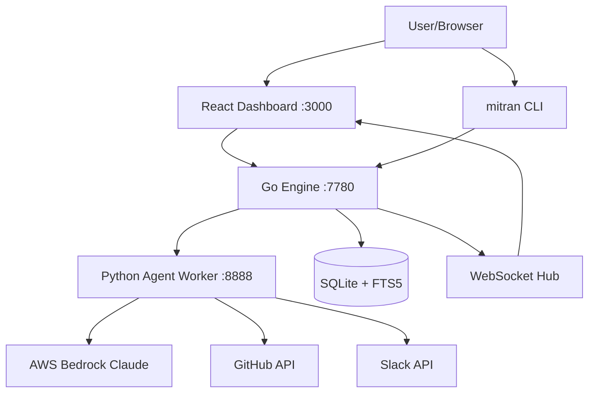
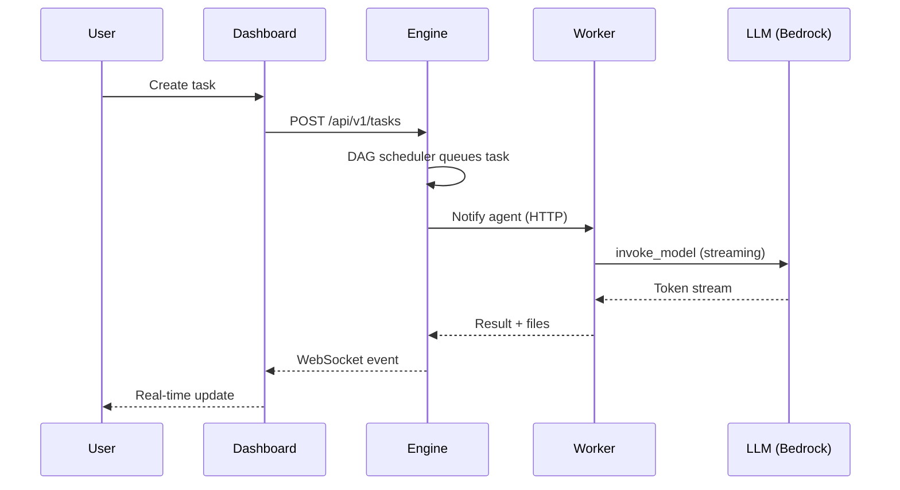
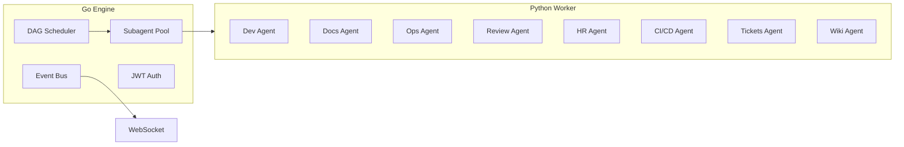
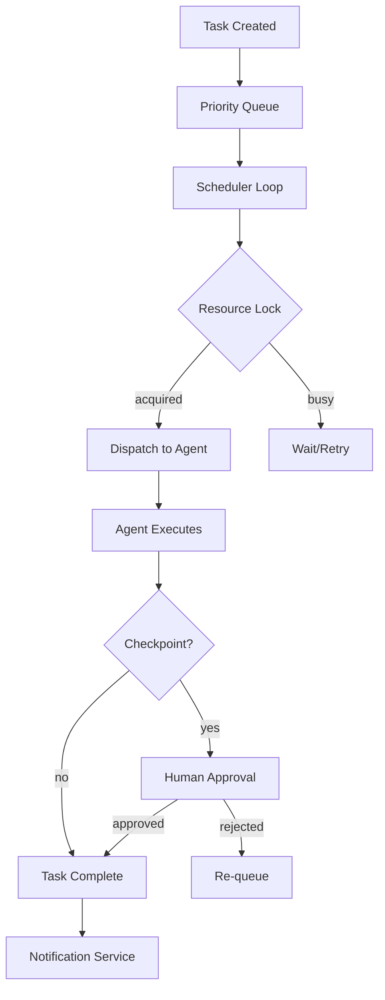

# Architecture Diagrams

## System Overview

```mermaid
graph TB
    User[User/Browser] --> Dashboard[React Dashboard :3000]
    User --> CLI[mitran CLI]
    Dashboard --> Engine[Go Engine :7780]
    CLI --> Engine
    Engine --> Worker[Python Agent Worker :8888]
    Engine --> SQLite[(SQLite + FTS5)]
    Engine --> WS[WebSocket Hub]
    Worker --> Bedrock[AWS Bedrock Claude]
    Worker --> GitHub[GitHub API]
    Worker --> Slack[Slack API]
    WS --> Dashboard
```

## Request Flow

```mermaid
sequenceDiagram
    participant U as User
    participant D as Dashboard
    participant E as Engine
    participant W as Worker
    participant L as LLM (Bedrock)

    U->>D: Create task
    D->>E: POST /api/v1/tasks
    E->>E: DAG scheduler queues task
    E->>W: Notify agent (HTTP)
    W->>L: invoke_model (streaming)
    L-->>W: Token stream
    W-->>E: Result + files
    E-->>D: WebSocket event
    D-->>U: Real-time update
```

## Agent Architecture

```mermaid
graph LR
    subgraph Engine[Go Engine]
        Scheduler[DAG Scheduler]
        Pool[Subagent Pool]
        Events[Event Bus]
        Auth[JWT Auth]
    end
    subgraph Worker[Python Worker]
        Dev[Dev Agent]
        Docs[Docs Agent]
        Ops[Ops Agent]
        Review[Review Agent]
        HR[HR Agent]
        CICD[CI/CD Agent]
        Tickets[Tickets Agent]
        Wiki[Wiki Agent]
    end
    Scheduler --> Pool
    Pool --> Worker
    Events --> WebSocket
```

## Data Flow

```mermaid
graph TD
    Task[Task Created] --> PQ[Priority Queue]
    PQ --> Sched[Scheduler Loop]
    Sched --> Lock{Resource Lock}
    Lock -->|acquired| Dispatch[Dispatch to Agent]
    Lock -->|busy| Wait[Wait/Retry]
    Dispatch --> Agent[Agent Executes]
    Agent --> CP{Checkpoint?}
    CP -->|yes| Approval[Human Approval]
    CP -->|no| Complete[Task Complete]
    Approval -->|approved| Complete
    Approval -->|rejected| Retry[Re-queue]
    Complete --> Notify[Notification Service]
```
